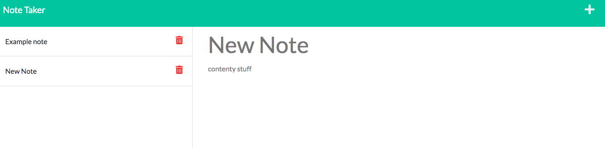

# Note Taker

## Table of Contents

- [Picture](#picture)
- [Description](#description)
- [License](#license)
- [Installation](#installation)
- [Usage](#usage)

## Picture

## Description

This is a note-taking application that saves the user's input notes and saves them to a back-end file.
The saved notes can be reopened and deleted.

## License

None

(Not licensed for use of any kind)

## Installation

The application can be viewed through Heroku.

## Usage

The user may input text into the title and text field and save notes by clicking the save button.
They can delete notes by clicking the delete buttons, and reopen any past notes by clicking on
their titles in the left-hand list.

## Link to application
https://rh-note-taker.herokuapp.com/notes